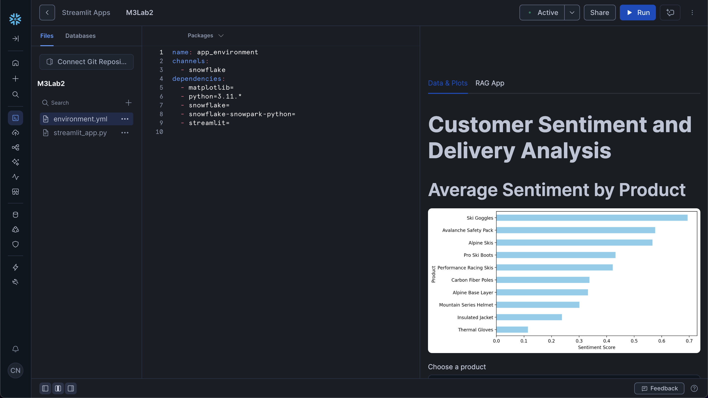
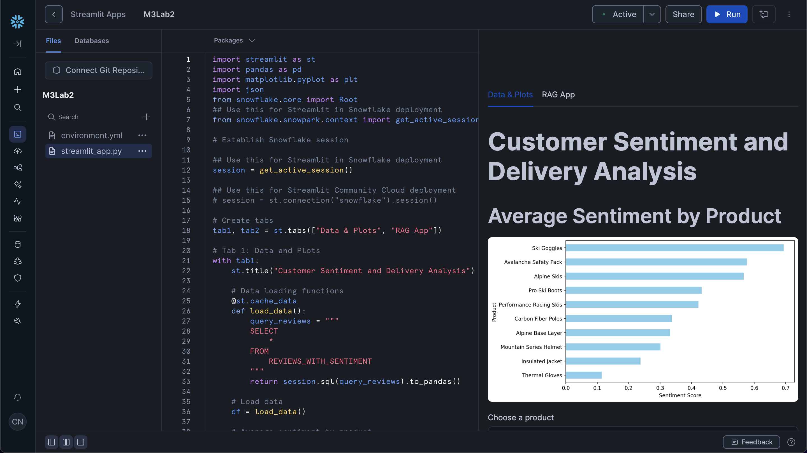

`Module 3`
# Lab 2: Integrating RAG into your chatbot

## Overview
- In Module 3 of the course, watch the *"Lab 2: Integrating RAG into your chatbot"* video for instructions on running the lab.

## Deploy to Streamlit in Snowflake
- For app deployment use either of these as the app file ([`M3Lab2.py`](M3Lab2.py), [`example_chatbot_with_history.py`](example_chatbot_with_history.py) and [`example_tabs.py`](example_tabs.py)) along with [`environment.yml`](environment.yml).
- You can copy/paste contents from the app file and `environment.yml` file in this repo into the ones in Snowflake found at the left File panel. This should also fix library dependency error (note that the library versions are unpinned meaning that no specific version are specified for the libraries so that they don't run into library dependency error).

  <table>
    <tr>
      <td></td>
      <td></td>
    </tr>
  </table>

**Further instructions on deployment:**
- In the course watch the *"Deploying Your Prototype Internally on Snowflake"* video.
- Follow step-by-step instructions in [Module 2 Lab 2](https://github.com/https-deeplearning-ai/fast-prototyping-of-genai-apps-with-streamlit/tree/main/M2/Lesson_02/Lab2).

## Deploy to Streamlit Community Cloud
- For app deployment use either of these as the app file ([`M3Lab2.py`](M3Lab2.py), [`example_chatbot_with_history.py`](example_chatbot_with_history.py) and [`example_tabs.py`](example_tabs.py)) along with [`requirements.txt`](requirements.txt).

**Further instructions on deployment:**
- Follow step-by-step instructions in [Module 3 Lab 1](https://github.com/https-deeplearning-ai/fast-prototyping-of-genai-apps-with-streamlit/tree/main/M3/Lesson_01/deploy).
